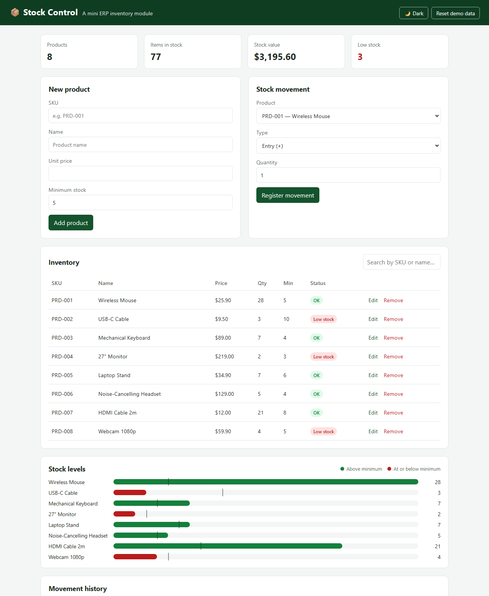
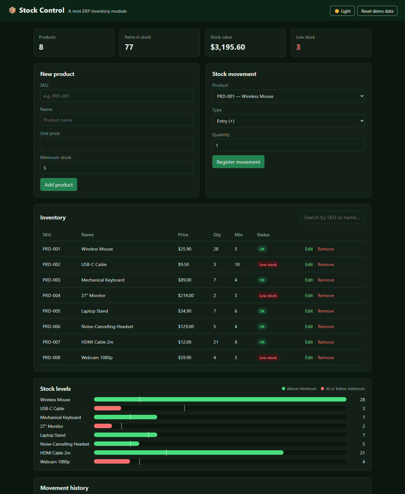

# 📦 Stock Control — Mini ERP

A lightweight inventory module inspired by ERP systems, built with **HTML, CSS and vanilla JavaScript** — no frameworks, no build step.

**[Live demo →](https://vinepimenta1708.github.io/stock-control/)**



<details>
<summary>Dark mode</summary>



</details>

## Features

- **Products** — register and edit products (SKU, name, unit price, minimum stock)
- **Stock movements** — entries and exits with validation (stock never goes negative)
- **Dashboard** — total products, items in stock, stock value and low-stock alerts
- **Inventory** — search by SKU or name, with a status badge for low stock
- **Stock levels chart** — current quantity per product, with a marker at the minimum
- **Movement history** — filter by product, type and date range, and export to CSV
- **Light / dark mode** — follows the system setting and remembers your choice
- **Sample data** — the app opens with demo products and a few weeks of history, and can be reset in one click
- Data saved in the browser with `localStorage`, responsive layout

## How it works

The whole app state is a single object saved to `localStorage`:

```js
{
  version: 2,   // bumped when the data format or sample data changes
  products: [{ sku, name, price, qty, min }],
  history:  [{ sku, type: "in" | "out", qty, date }]
}
```

Every action (add product, register movement, remove…) updates the state, saves it and re-renders the screen from it. Keeping one source of truth makes the dashboard, table, chart and history always agree with each other.

A few decisions along the way:

- **The SKU is the product key**, so it can't be changed when editing a product.
- **Low stock means quantity at or below the minimum**, the same rule used for the badge, the dashboard card and the chart colors.
- **The demo history is generated from the movements**, so the sample quantities always match the history.
- **User input is escaped** before being rendered, and CSV fields are quoted when needed (RFC 4180).

## Project structure

```
stock-control/
├── index.html   # layout and forms
├── style.css    # theme tokens (light/dark) and components
├── app.js       # state, rendering and event handlers
└── docs/        # screenshots used in this README
```

## Running locally

Clone the repo and open `index.html` in your browser:

```bash
git clone https://github.com/vinepimenta1708/stock-control.git
cd stock-control
```

## Roadmap

- [x] Edit products
- [x] Filter history by product and type
- [x] Stock level chart
- [x] Filter history by date range
- [ ] Suppliers and purchase orders
- [ ] Back-end with a database (Node.js + SQL)

## Author

**Vinícius Pimenta** — [LinkedIn](https://www.linkedin.com/in/vin%C3%ADcius-pimenta-67164a236) · [GitHub](https://github.com/vinepimenta1708)

## License

[MIT](LICENSE)
